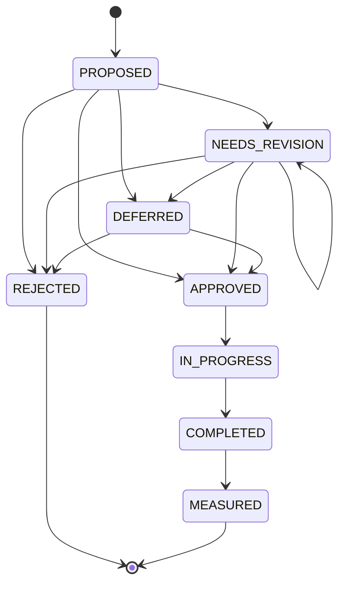

# Director Artur — Protocol

Artur is RT's Director-level AI (spec s.5–s.9): the highest AI operational
role below the human Founder. It observes, synthesizes, verifies, proposes,
and escalates. It never becomes a second execution layer over the
specialist agents — see `docs/AGENT_CONSTITUTION.md` s.3 and
`src/lib/artur/boundary.test.ts` for the enforced boundary.

## 1. Daily Founder Brief (spec s.9–s.10)

- **When**: every day at 08:00 Asia/Bishkek, via `POST /api/cron/artur-daily`
  (Vercel Cron, `vercel.json`) → `runDailyFounderBriefJob`
  (`src/lib/artur/scheduler.ts`) → `generateDailyFounderBrief`
  (`src/lib/artur/daily-brief.ts`).
- **Idempotency**: keyed by Bishkek calendar date on two independent
  layers — `ScheduledJobRun`'s `@@unique([jobName, periodKey])` (a restart
  or duplicate cron trigger for the same date is a no-op once `SUCCEEDED`)
  and `FounderBrief`'s own `reportDate` uniqueness.
- **Structure** (`DailyFounderBrief`, validated by
  `dailyFounderBriefSchema` in `src/lib/artur/types.ts`): `overallStatus`
  (NORMAL/ATTENTION/CRITICAL), `keyEvents`, `passenger`, `cargo`,
  `finance`, `complaints`, `stuckTasks`, `risksToday`,
  `decisionsArturTook`, `founderDecisionsRequired`. An empty section is
  rendered with a brief "NORMAL" note — never padded with manufactured
  bureaucracy (spec s.10).
- **Manual trigger**: `generateDailyBriefNowAction` in
  `src/app/dispatcher/artur-actions.ts`, founder-role-gated, from
  `/dispatcher/artur`.

## 2. Weekly Director Report (spec s.11–s.15)

- **When**: every Monday at 10:00 Asia/Bishkek via
  `/api/cron/artur-weekly` → `runWeeklyDirectorReportJob` →
  `generateWeeklyDirectorReport` (`src/lib/artur/weekly-report.ts`).
- **Idempotency**: `ScheduledJobRun` keyed by `weekStartKey`
  (Bishkek Monday date), plus `WeeklyDirectorReport.weekStartDate`
  uniqueness.
- **KPI table**: week-over-week, computed by
  `computeWeekOverWeekChange` (`src/lib/artur/period.ts`). Zero-baseline is
  handled explicitly — both weeks zero → `STABLE`/`percentageChange: null`;
  zero-baseline with real growth → `GROWTH`/`percentageChange: null`,
  **never `Infinity`**. A change within ±1% is `STABLE`, not noise reported
  as a trend.
- **Problems of the week**: each `ProblemOfTheWeek` carries `rootCause:
  string | null`. `null` means "not yet established" and the UI renders it
  as a hypothesis, never presented as a confirmed cause (spec s.34).
- **Exactly 3 initiatives — non-negotiable** (spec s.15/s.35): enforced
  twice — structurally by `weeklyInitiativesSchema` (`z.array(...).length(3)`
  in `types.ts`) and again by `assertExactlyThreeInitiatives`
  (`initiatives.ts`), which throws rather than padding or truncating on a
  wrong count. A wrong count is a defect Artur must surface, never
  silently repair by fabricating a plausible 4th initiative.

## 3. Founder Approval Workflow (spec s.16, s.23)

`DirectorInitiative.status` is a `FounderInitiativeStatus` state machine,
never an arbitrary string an LLM assigns directly
(`isValidInitiativeTransition` in `src/lib/artur/initiatives.ts` is the
single source of truth, unit-tested exhaustively in
`initiatives.test.ts`):

Artur never auto-implements anything past `PROPOSED` — every forward
transition requires an explicit `recordFounderInitiativeDecision` /
`recordInitiativeImplementationResult` /
`recordInitiativeMeasuredEffect` call, each `requireFounderRole`-gated. A
lack of Founder response leaves the initiative sitting at `PROPOSED`
indefinitely — it is never interpreted as approval.

## 4. Emergency escalation (spec s.17–s.18)

- **Gate**: `raiseEmergencyIncident` (`src/lib/artur/emergency.ts`) rejects
  anything below HIGH severity outright — `isEmergencySeverity` is the only
  check, so a routine operational issue can never reach the Founder as a
  "24/7 emergency" by mistake.
- **Idempotency**: `EmergencyIncident.sourceEventKey` is unique; a retried
  detector run for the same underlying event returns the existing incident
  rather than creating a duplicate.
- **Two raise paths**: a deterministic detector
  (`detectFinancialEmergencies`, threshold-only on real
  `AccountantCase.amountSom` via `severityForDiscrepancySom` — never a
  judgment call), and the dispatcher-facing `reportEmergencyAction` form
  (`/dispatcher/artur`), open to **any authenticated dispatcher**, not only
  the Founder role — a genuine force-majeure report must not be blocked on
  who happens to be logged in.
- **10-point structure** (`EmergencyFounderEscalation` schema):
  `whatHappened`, `currentStatus`, `severity`, `peopleOrdersMoneyAffected`,
  `actionsTaken`, `immediateRisks`, `availableOptions`, `recommendation`,
  `decisionRequired`, `decisionDeadline`.
- **Resolution**: `acknowledgeEmergencyIncident` /
  `resolveEmergencyIncident`, both founder-role-gated.

## 5. Severity framework (spec s.19)

`src/lib/artur/severity.ts` — `INFO < NORMAL < ATTENTION < HIGH <
CRITICAL`, deterministic threshold functions
(`severityForCaseAgeMs`, `severityForDiscrepancySom`), `overallRtStatus`
collapsing any HIGH/CRITICAL signal to a top-line `CRITICAL` status. Claude
adds narrative context to an already-assigned severity; it never assigns
the severity itself.

## 6. NotificationGateway honesty (spec s.30)

`src/lib/artur/notification-gateway.ts`'s `deliver()` is idempotent per
`idempotencyKey` (`DAILY:<id>` / `WEEKLY:<id>` / `EMERGENCY:<id>` — a
second call for the same brief/report/incident short-circuits on an
existing `DELIVERED`/`SENDING` row rather than sending twice) and, with
`CHANNEL_ADAPTERS` empty (the current real state — no Telegram/WhatsApp/
email integration exists yet), **every delivery attempt is honestly
recorded `FAILED` with `lastError: "NO_CHANNEL_CONFIGURED"`**. It is never
faked as `DELIVERED`. `notification-gateway.test.ts` asserts both
properties against an in-memory mock of the two Prisma models it touches.
When a real channel adapter is added, it registers in
`CHANNEL_ADAPTERS` — no other code in the gateway needs to change.

## 7. Scheduler reliability (spec s.31)

`src/lib/artur/scheduler.ts`'s `runIdempotentJob` mirrors the proven
`ScheduledJobRun` pattern from `src/lib/jolchu/data-refresh.ts`: create as
`RUNNING`, try the work, update to `SUCCEEDED`/`FAILED`. A restart mid-run
leaves the row `RUNNING`; the next invocation for the same `periodKey`
re-attempts the work (report-level uniqueness on `reportDate` /
`weekStartDate` still prevents a duplicate report even if the job-level
retry races). Both cron routes (`/api/cron/artur-daily`,
`/api/cron/artur-weekly`) fail closed: if `CRON_SECRET` is unset, every
request is rejected with 401 — there is no code path where an unset secret
allows an unauthenticated trigger.

## 8. Decision boundary categories (spec s.28)

| Category | Examples | Enforcement |
|---|---|---|
| `AUTO_DIRECTOR_ALLOWED` | Generating the daily brief, weekly report, opening an `EmergencyIncident` from the deterministic detector | Runs on schedule / on threshold breach, no Founder gate |
| `DIRECTOR_RECOMMENDATION_ONLY` | The 3 weekly initiatives, `recommendation`/`availableOptions` fields on an emergency escalation | Persisted as a proposal; never auto-executed |
| `FOUNDER_APPROVAL_REQUIRED` | Any `DirectorInitiative` transition past `PROPOSED` | `requireFounderRole` gate on every write |
| `EMERGENCY_FOUNDER_REQUIRED` | Acknowledging/resolving an `EmergencyIncident` | `requireFounderRole` gate; raising one is open to any dispatcher (s.4 above), resolving it is not |

## 9. What Claude does and does not do (spec s.32–s.33)

Claude (via the provider-abstracted layer under `src/lib/mira/providers/`'s
pattern) performs synthesis, analysis, prioritization, summarization, and
proposal drafting — the prose inside a brief section, the wording of an
initiative's `proposal`/`whyNow`/`risks`. It never performs permission
checks, financial authorization, idempotency handling, scheduling, or
database-integrity decisions — those are the plain functions and Prisma
unique constraints documented above. Every structured output Artur
produces is validated against a zod schema in `src/lib/artur/types.ts`
before it is persisted or handed to the notification gateway; invalid
model output is rejected, never silently coerced into a plausible-looking
but wrong shape.
