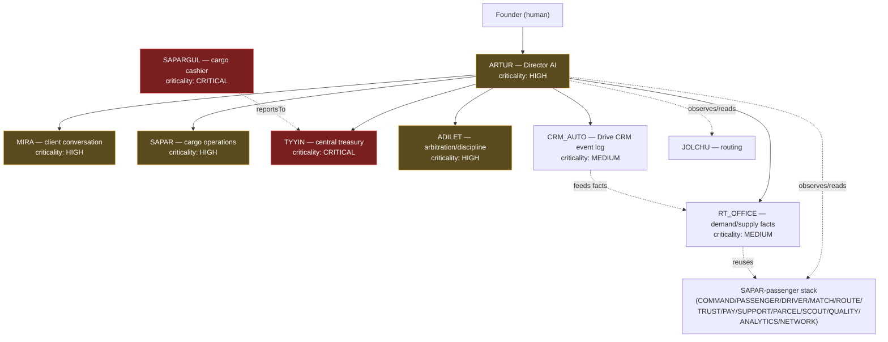

# RT Organization Map

Externally: **ONE RT. ONE SIMPLE SERVICE. ONE RELIABLE RESULT.** Internally:
a layered AI organization reporting into a human Founder, with Director
Artur as the AI-side management layer. This document is the map; each
agent's binding contract lives in its own `orchestrator.ts` and is indexed
in `src/lib/agents/registry.ts`'s `AGENT_REGISTRY`.

## 1. Org chart

`reportsTo` on an `AgentContract` is the authoritative source for this
chart — regenerate it from `AGENT_REGISTRY` rather than hand-editing it if
the reporting lines change. Sapargul reports operationally to Tyyin (the
treasurer confirms what the cashier requests); Tyyin, Adilet, Sapar, and
Mira all report to Artur; Artur reports to the Founder. Jolchu (routing)
and the passenger-side agent stack (Command/Passenger/Driver/Match/Route/
Trust/Pay/Support/Parcel/Scout/Quality/Analytics/Network) are not yet
retrofitted with a `reportsTo` line — Artur observes their output through
RT Core's data (Trip/TripRequest) without a direct management edge, per
spec s.0.3 ("do not rewrite working systems unnecessarily").

## 2. Agent registry summary

| Agent | Mission (one line) | Reports to | Criticality |
|---|---|---|---|
| ARTUR | Director: daily/weekly reporting, initiatives, emergency escalation | FOUNDER | HIGH |
| MIRA | Sole external customer conversation channel | ARTUR | HIGH |
| SAPAR | Cargo operational status, executor assignment | ARTUR | HIGH |
| SAPARGUL | Cargo payment requests + evidence intake (never confirms) | TYYIN | CRITICAL |
| TYYIN | Central treasury journal, bank reconciliation, inbound-only | ARTUR | CRITICAL |
| ADILET | Independent complaint arbitration and sanctions | ARTUR | HIGH |
| RT_OFFICE | Converts RT Core's Driver/DriverOffer/Match/Trip state + CRM Auto facts into verified demand/supply facts for Mira | ARTUR | MEDIUM |
| CRM_AUTO | Services Drive CRM: append-only ETA/breakdown/backhaul/history log (`DriveCrmEvent`) | ARTUR | MEDIUM |
| JOLCHU | Route/geo resolution | — | — |
| COMMAND / PASSENGER / DRIVER / MATCH / ROUTE / TRUST / PAY / SUPPORT / PARCEL / SCOUT / QUALITY / ANALYTICS / NETWORK | Passenger-side matching/dispatch stack | — | — |

Full contracts (mission, inputs, outputs, permissions, `prohibitedActions`,
KPIs, escalation rules) live in each agent's `orchestrator.ts` — this table
is a summary, not a replacement.

## 3. Event catalog

RT has no message broker. Every "event" is an `AuditLogEntry` row
(`agentName` tag + `details.event` = one of the names below), written via
each domain's `log<Agent>Action()` / `emit<Agent>Event()` pair
(`src/lib/agents/trace.ts` is the shared primitive underneath all of them).
This keeps the event log append-only, queryable by `traceId` for full
per-request causality, and requires no new infrastructure.

### Artur (`src/lib/artur/events.ts` — `ArturEvent`)

| Event | Raised when |
|---|---|
| `DIRECTOR_DAILY_REVIEW_STARTED` | Daily brief generation begins |
| `FOUNDER_BRIEF_READY` | A `FounderBrief` row is persisted |
| `WEEKLY_REPORT_READY` | A `WeeklyDirectorReport` row is persisted |
| `DIRECTOR_INITIATIVE_PROPOSED` | One of the week's 3 initiatives is created |
| `FOUNDER_INITIATIVE_DECISION` | Founder decides APPROVED/REJECTED/DEFERRED/NEEDS_REVISION |
| `NOTIFICATION_DELIVERY_ATTEMPTED` | NotificationGateway attempts a send (honest FAILED included) |
| `CRITICAL_INCIDENT_DETECTED` | A HIGH/CRITICAL signal crosses the emergency threshold |
| `FOUNDER_EMERGENCY_ESCALATION` | An `EmergencyIncident` is raised/acknowledged/resolved |
| `SCHEDULED_JOB_STARTED` / `SCHEDULED_JOB_SUCCEEDED` / `SCHEDULED_JOB_FAILED` | The 08:00 daily / Monday 10:00 weekly cron job's lifecycle |
| `MANAGER_REPORT_DISCREPANCY_FLAGGED` | A manager-reported summary contradicts RT Core's authoritative data |

### Tyyin (`src/lib/tyyin/events.ts` — `TyyinEvent`)

Bank transaction ingestion, reconciliation outcomes (matched/mismatched/
needs-manual-review), accountant-case open/resolve/close.

### Adilet (`src/lib/adilet/events.ts` — `AdiletEvent`)

Case opened/evidence attached/moved to review/closed, decision recorded,
sanction applied/reversed, appeal requested/resolved, escalation to
Director.

### Sapargul (`src/lib/sapargul/events.ts`)

Payment request created, instructions issued, evidence submitted,
treasurer confirmation/rejection/mismatch relayed back to Sapar's payment
gate.

Every other pre-existing domain (Mira, Sapar, Jolchu, the passenger stack)
follows the same `log<Agent>Action` pattern; see each domain's own
`events.ts` (or inline logging in its orchestrator) for its specific event
names — this catalog documents Artur's new events plus the three domains
Artur directly reads from, not a re-listing of every event in the codebase.

## 4. How Artur observes without owning

Artur's `AgentContract.canRead` lists exactly what it reads:
`trip_request`, `trip`, `shipment`, `shipment_incident`, `adilet_case`,
`treasury_period_report`, `driver_offer`, `match`, `drive_crm_event`. The
`treasury_period_report` entry is deliberate: Artur never recomputes
Tyyin's financial numbers from raw `TreasuryTransaction` rows itself — it
calls Tyyin's own `buildTreasuryDailyReport` (`src/lib/tyyin/reports.ts`),
so there is exactly one financial-reporting code path, and Artur's
dashboard can never silently drift from what Tyyin itself would report.
`src/lib/artur/boundary.test.ts` guards the write side of this: no file
under `src/lib/artur/` may import a mutation function from Sapargul,
Tyyin, or Adilet directly.

## 5. RT OFFICE + CRM Auto — demand/supply facts and Drive CRM

**"CLIENTS NEED VEHICLES. VEHICLES NEED CLIENTS."** RT OFFICE's whole job is
continuously comparing unresolved passenger demand (`TripRequest`) against
verified driver supply (`DriverOffer`) and converting RT Core's existing
state into structured, never-invented facts for Mira to phrase — it never
talks to a passenger or driver itself (`src/lib/rt-office/boundary.test.ts`
forbids importing any messaging/payment function), never owns Mira CRM data,
and never runs a second matching engine: candidate scoring is
`src/lib/matching/engine.ts`'s real `findCandidateOffers`
(`src/lib/rt-office/facts.ts`), and its one write path
(`reportSupplyAvailable`) re-triggers the existing MATCH agent
(`src/lib/agents/match.ts`) rather than writing `DriverOffer`/`Match`/`Trip`
itself. Its read path also reuses `matching/orchestrate.ts`'s real
exclusion-aware logic (`excludedOfferIdsForRequest`, the same function
`proposeMatchesForRequest` uses) rather than a weaker parallel advisory
query, so it can never describe an offer to a passenger the driver has
already declined for their request.

CRM Auto services **Drive CRM**: it owns exactly one Prisma model
(`DriveCrmEvent`, append-only) and the `drive_crm_event_write` exclusive
capability, recording only verified operational ETA, breakdown/incident,
backhaul-opportunity, and operational-history facts —
`recordOperationalEvent` is idempotent against duplicate webhook/event
delivery via `DriveCrmEvent.idempotencyKey`'s real DB unique constraint
(Prisma P2002), and breakdown open/resolve transitions
(`src/lib/crm-auto/lifecycle.ts`) are deterministic code, never a free-form
LLM decision. RT OFFICE reads CRM Auto's facts exclusively through
`src/lib/crm-auto/bridge.ts` rather than querying `DriveCrmEvent` directly,
so CRM Auto stays the single read/write access point onto its own model.
Rows are never updated or deleted (`src/lib/crm-auto/boundary.test.ts`
forbids `db.driveCrmEvent.update`/`.delete`/`.upsert`) — full historical
auditability is preserved by `recordExceptionalCorrection` appending a new
`CORRECTION` event that references the original via `correctsEventId`
instead of mutating it. A `CORRECTION` referencing the driver's latest OPEN
breakdown does have real effect on derived operational state: RT OFFICE's
`latestOpenBreakdownForDriver` (`src/lib/crm-auto/bridge.ts`) reads the
driver's most recent `BREAKDOWN_INCIDENT` row and reports no open breakdown
if that row is either superseded by a newer `RESOLVED` row or covered by a
`CORRECTION` — the original `BREAKDOWN_INCIDENT` row's `incidentStatus`
itself is still never mutated; only what this derived read reports changes.

Both report to Artur with read-only visibility (`canRead` includes
`driver_offer`, `match`, `drive_crm_event`) and neither declares a
`director_*` or other manager-agent capability — see
`docs/AGENT_CONSTITUTION.md` s.2 for the full exclusive-capability table.
