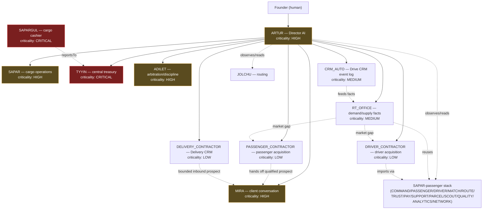
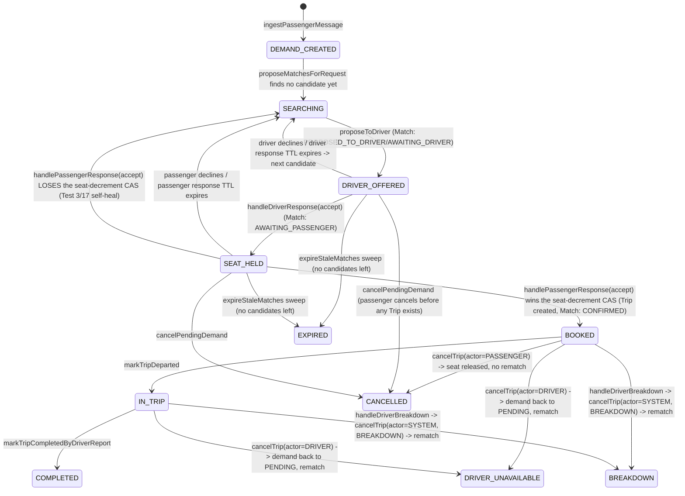
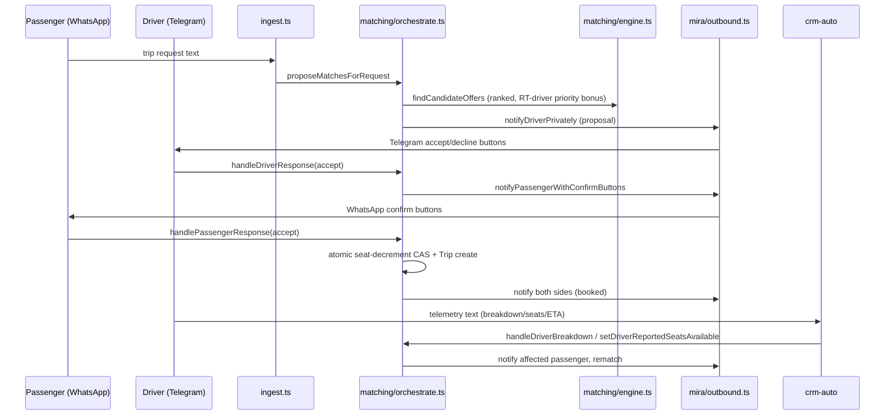

# RT Organization Map

Externally: **ONE RT. ONE SIMPLE SERVICE. ONE RELIABLE RESULT.** Internally:
a layered AI organization reporting into a human Founder, with Director
Artur as the AI-side management layer. This document is the map; each
agent's binding contract lives in its own `orchestrator.ts` and is indexed
in `src/lib/agents/registry.ts`'s `AGENT_REGISTRY`.

## 1. Org chart

`reportsTo` on an `AgentContract` is the authoritative source for this
chart — regenerate it from `AGENT_REGISTRY` rather than hand-editing it if
the reporting lines change. Sapargul reports operationally to Tyyin (the
treasurer confirms what the cashier requests); Tyyin, Adilet, Sapar, and
Mira all report to Artur; Artur reports to the Founder. Jolchu (routing)
and the passenger-side agent stack (Command/Passenger/Driver/Match/Route/
Trust/Pay/Support/Parcel/Scout/Quality/Analytics/Network) are not yet
retrofitted with a `reportsTo` line — Artur observes their output through
RT Core's data (Trip/TripRequest) without a direct management edge, per
spec s.0.3 ("do not rewrite working systems unnecessarily").

## 2. Agent registry summary

| Agent | Mission (one line) | Reports to | Criticality |
|---|---|---|---|
| ARTUR | Director: daily/weekly reporting, initiatives, emergency escalation | FOUNDER | HIGH |
| MIRA | Sole external customer conversation channel | ARTUR | HIGH |
| SAPAR | Cargo operational status, executor assignment | ARTUR | HIGH |
| SAPARGUL | Cargo payment requests + evidence intake (never confirms) | TYYIN | CRITICAL |
| TYYIN | Central treasury journal, bank reconciliation, inbound-only | ARTUR | CRITICAL |
| ADILET | Independent complaint arbitration and sanctions | ARTUR | HIGH |
| RT_OFFICE | Converts RT Core's Driver/DriverOffer/Match/Trip state + CRM Auto facts into verified demand/supply facts for Mira | ARTUR | MEDIUM |
| CRM_AUTO | Services Drive CRM: append-only ETA/breakdown/backhaul/history log (`DriveCrmEvent`) | ARTUR | MEDIUM |
| DRIVER_CONTRACTOR | Grows verified driver supply from public/permitted sightings via SCOUT's existing pipeline, gated by Market Gap | ARTUR | LOW |
| PASSENGER_CONTRACTOR | Grows passenger demand from public/permitted sightings (`PassengerProspect`), hands qualified prospects to Mira | ARTUR | LOW |
| DELIVERY_CONTRACTOR | Grows the delivery business-partnership pipeline (`BusinessProspect` + Delivery CRM `DeliveryCrmEvent`) | ARTUR | LOW |
| JOLCHU | Route/geo resolution | — | — |
| COMMAND / PASSENGER / DRIVER / MATCH / ROUTE / TRUST / PAY / SUPPORT / PARCEL / SCOUT / QUALITY / ANALYTICS / NETWORK | Passenger-side matching/dispatch stack | — | — |

Full contracts (mission, inputs, outputs, permissions, `prohibitedActions`,
KPIs, escalation rules) live in each agent's `orchestrator.ts` — this table
is a summary, not a replacement.

## 3. Event catalog

RT has no message broker. Every "event" is an `AuditLogEntry` row
(`agentName` tag + `details.event` = one of the names below), written via
each domain's `log<Agent>Action()` / `emit<Agent>Event()` pair
(`src/lib/agents/trace.ts` is the shared primitive underneath all of them).
This keeps the event log append-only, queryable by `traceId` for full
per-request causality, and requires no new infrastructure.

### Artur (`src/lib/artur/events.ts` — `ArturEvent`)

| Event | Raised when |
|---|---|
| `DIRECTOR_DAILY_REVIEW_STARTED` | Daily brief generation begins |
| `FOUNDER_BRIEF_READY` | A `FounderBrief` row is persisted |
| `WEEKLY_REPORT_READY` | A `WeeklyDirectorReport` row is persisted |
| `DIRECTOR_INITIATIVE_PROPOSED` | One of the week's 3 initiatives is created |
| `FOUNDER_INITIATIVE_DECISION` | Founder decides APPROVED/REJECTED/DEFERRED/NEEDS_REVISION |
| `NOTIFICATION_DELIVERY_ATTEMPTED` | NotificationGateway attempts a send (honest FAILED included) |
| `CRITICAL_INCIDENT_DETECTED` | A HIGH/CRITICAL signal crosses the emergency threshold |
| `FOUNDER_EMERGENCY_ESCALATION` | An `EmergencyIncident` is raised/acknowledged/resolved |
| `SCHEDULED_JOB_STARTED` / `SCHEDULED_JOB_SUCCEEDED` / `SCHEDULED_JOB_FAILED` | The 08:00 daily / Monday 10:00 weekly cron job's lifecycle |
| `MANAGER_REPORT_DISCREPANCY_FLAGGED` | A manager-reported summary contradicts RT Core's authoritative data |

### Tyyin (`src/lib/tyyin/events.ts` — `TyyinEvent`)

Bank transaction ingestion, reconciliation outcomes (matched/mismatched/
needs-manual-review), accountant-case open/resolve/close.

### Adilet (`src/lib/adilet/events.ts` — `AdiletEvent`)

Case opened/evidence attached/moved to review/closed, decision recorded,
sanction applied/reversed, appeal requested/resolved, escalation to
Director.

### Sapargul (`src/lib/sapargul/events.ts`)

Payment request created, instructions issued, evidence submitted,
treasurer confirmation/rejection/mismatch relayed back to Sapar's payment
gate.

Every other pre-existing domain (Mira, Sapar, Jolchu, the passenger stack)
follows the same `log<Agent>Action` pattern; see each domain's own
`events.ts` (or inline logging in its orchestrator) for its specific event
names — this catalog documents Artur's new events plus the three domains
Artur directly reads from, not a re-listing of every event in the codebase.

## 4. How Artur observes without owning

Artur's `AgentContract.canRead` lists exactly what it reads:
`trip_request`, `trip`, `shipment`, `shipment_incident`, `adilet_case`,
`treasury_period_report`, `driver_offer`, `match`, `drive_crm_event`. The
`treasury_period_report` entry is deliberate: Artur never recomputes
Tyyin's financial numbers from raw `TreasuryTransaction` rows itself — it
calls Tyyin's own `buildTreasuryDailyReport` (`src/lib/tyyin/reports.ts`),
so there is exactly one financial-reporting code path, and Artur's
dashboard can never silently drift from what Tyyin itself would report.
`src/lib/artur/boundary.test.ts` guards the write side of this: no file
under `src/lib/artur/` may import a mutation function from Sapargul,
Tyyin, or Adilet directly.

## 5. RT OFFICE + CRM Auto — demand/supply facts and Drive CRM

**"CLIENTS NEED VEHICLES. VEHICLES NEED CLIENTS."** RT OFFICE's whole job is
continuously comparing unresolved passenger demand (`TripRequest`) against
verified driver supply (`DriverOffer`) and converting RT Core's existing
state into structured, never-invented facts for Mira to phrase — it never
talks to a passenger or driver itself (`src/lib/rt-office/boundary.test.ts`
forbids importing any messaging/payment function), never owns Mira CRM data,
and never runs a second matching engine: candidate scoring is
`src/lib/matching/engine.ts`'s real `findCandidateOffers`
(`src/lib/rt-office/facts.ts`), and its one write path
(`reportSupplyAvailable`) re-triggers the existing MATCH agent
(`src/lib/agents/match.ts`) rather than writing `DriverOffer`/`Match`/`Trip`
itself. Its read path also reuses `matching/orchestrate.ts`'s real
exclusion-aware logic (`excludedOfferIdsForRequest`, the same function
`proposeMatchesForRequest` uses) rather than a weaker parallel advisory
query, so it can never describe an offer to a passenger the driver has
already declined for their request.

CRM Auto services **Drive CRM**: it owns exactly one Prisma model
(`DriveCrmEvent`, append-only) and the `drive_crm_event_write` exclusive
capability, recording only verified operational ETA, breakdown/incident,
backhaul-opportunity, and operational-history facts —
`recordOperationalEvent` is idempotent against duplicate webhook/event
delivery via `DriveCrmEvent.idempotencyKey`'s real DB unique constraint
(Prisma P2002), and breakdown open/resolve transitions
(`src/lib/crm-auto/lifecycle.ts`) are deterministic code, never a free-form
LLM decision. RT OFFICE reads CRM Auto's facts exclusively through
`src/lib/crm-auto/bridge.ts` rather than querying `DriveCrmEvent` directly,
so CRM Auto stays the single read/write access point onto its own model.
Rows are never updated or deleted (`src/lib/crm-auto/boundary.test.ts`
forbids `db.driveCrmEvent.update`/`.delete`/`.upsert`) — full historical
auditability is preserved by `recordExceptionalCorrection` appending a new
`CORRECTION` event that references the original via `correctsEventId`
instead of mutating it. A `CORRECTION` referencing the driver's latest OPEN
breakdown does have real effect on derived operational state: RT OFFICE's
`latestOpenBreakdownForDriver` (`src/lib/crm-auto/bridge.ts`) reads the
driver's most recent `BREAKDOWN_INCIDENT` row and reports no open breakdown
if that row is either superseded by a newer `RESOLVED` row or covered by a
`CORRECTION` — the original `BREAKDOWN_INCIDENT` row's `incidentStatus`
itself is still never mutated; only what this derived read reports changes.

Both report to Artur with read-only visibility (`canRead` includes
`driver_offer`, `match`, `drive_crm_event`) and neither declares a
`director_*` or other manager-agent capability — see
`docs/AGENT_CONSTITUTION.md` s.2 for the full exclusive-capability table.

### 5.1 Live Fleet Picture — nationwide dispatcher read model

`src/lib/rt-office/fleet-picture.ts`'s `buildLiveFleetPicture()` is RT
OFFICE's aggregated, whole-network view for a human dispatcher — **not** a
new persisted model and **not** a second matching/status engine. It is a
computed read model (`DriverOperationalSnapshot[]` plus network-wide totals,
`src/lib/rt-office/types.ts`) built fresh on every call from the same tables
and the same `deriveOperationalState()` (`src/lib/rt-office/operational-state.ts`)
that RT OFFICE's per-request `resolveDemandAgainstSupply` already uses, so a
driver's state can never disagree between the two views.

For each driver, exactly one "current operational context" is picked by a
deterministic rule (`pickCurrentContext`, no LLM involved): a non-terminal
Trip (`SCHEDULED`/`IN_PROGRESS`) outranks a merely-open `DriverOffer`, which
in turn outranks falling back to the driver's most recent Trip of any
status — the only way a just-arrived, just-completed, or just-cancelled
driver stays visible as such until superseded by a new offer. A driver with
neither ever falls through to `AVAILABLE`/`OFFLINE` from `Driver.status`
alone.

Every query is batched across the whole driver set — `Prisma`'s
`distinct: ["driverId"]` + compound `orderBy` idiom for "latest row per
driver" in one query, plus the existing `openBreakdownForDrivers` and the new
`latestVerifiedEtaForOffers` (`src/lib/crm-auto/bridge.ts`, same "one bulk
query, reduce in JS" shape) — so the query count stays constant regardless
of fleet size, never one query per driver.

Seat accounting follows `DriverOffer` as the sole source of truth:
`seatsOccupied` is always `seatsTotal - seatsAvailable`, never a second
stored counter, and the network-wide `seatsAvailableTotal`/
`seatsOccupiedTotal` only sum drivers whose state represents real usable
supply today (`AVAILABLE`/`PLANNED`/`WAITING_DEPARTURE`/`EN_ROUTE`/
`DELAYED`) — a `BREAKDOWN`, `CANCELLED`, `OFFLINE`, `ARRIVED`, or `COMPLETED`
driver's seats are historical, not capacity a dispatcher can sell right now.

ETA is only ever the latest verified `DriveCrmEvent(OPERATIONAL_ETA)` fact
for a driver's current offer — `null` when none exists, never computed or
guessed by RT OFFICE/CRM Auto. `getEtaStalenessMinutes()`
(`src/lib/crm-auto/config.ts`, default 30, `CRM_AUTO_ETA_STALENESS_MINUTES`
override) only flags an old fact as stale in the dispatcher UI; it never
replaces or discards the value itself.

A real return-leg `DriverOffer` (`isReturnLeg: true`, created by the
existing `buildReturnLegOfferInput`/`completeTrip`) is surfaced per-driver
and counted in `returnLegOfferCount` — this is never conflated with CRM
Auto's separate `BACKHAUL_OPPORTUNITY` signal, which is an operational
observation, not a real offer.

Two dispatcher screens consume this:

- `/dispatcher/rt-office` — a "Живая линия RT" panel above the existing,
  unmodified demand↔supply block.
- `/dispatcher/drive-crm` — a "Сейчас" summary with per-vehicle rows and
  quick filters by `operationalState` (server-side, via the page's
  `searchParams`), above the existing, unmodified append-only
  `DriveCrmEvent` journal table.

### 5.2 Driver Operations Detail + Attention Feed — single-driver deep-dive

`src/lib/rt-office/driver-detail.ts`'s `buildDriverOperationsDetail(driverId)`
is a single-driver read model for `/dispatcher/drive-crm/[id]` — **not** a
second snapshot engine. `fleet-picture.ts` now exports its snapshot assembly
as `buildDriverOperationalSnapshot()` and its context-priority rule as
`selectCurrentContext()`, and Driver Detail calls these exact functions, so a
driver's state can never disagree between the fleet-wide "Живая линия"/"Сейчас"
views and their own detail page. Driver Detail never calls
`buildLiveFleetPicture().drivers.find(...)` — it runs its own small, fixed set
of driverId-scoped queries instead, so opening one driver's page never costs a
whole-fleet query. It also surfaces the driver's recent `DriveCrmEvent`
history (append-only — a `CORRECTION` is rendered as an additional entry
referencing the original, never a replacement) and a bounded, recent
Trip/DriverOffer history, deliberately without passenger identity fields.

`src/lib/rt-office/attention.ts`'s `deriveFleetAttentionFeed(fleet)` is a
computed, non-persisted `FleetAttentionFeed` — it takes an already-fetched
`LiveFleetPicture` and derives synchronously, with no DB access of its own, so
adding it to a dispatcher page never doubles that page's query count. It only
ever reports facts already present in the snapshot: `BREAKDOWN_OPEN`
(CRITICAL, from `breakdownOpen`), `VERIFIED_DELAY` (HIGH, from
`operationalState === "DELAYED"`, which itself only exists via CRM Auto's
verified delayed signal), `ETA_STALE` (WARNING, from `etaFreshness.stale` —
worded as "ETA is stale," never as an inference that the driver is late), and
`ETA_MISSING` (WARNING while underway, INFO before departure — worded as "no
confirmed ETA," never as "driver is lost"). There is no wall-clock lateness
inference and no self-computed ETA anywhere in this feed; absent data is
never treated as an incident. Items sort deterministically by severity
(CRITICAL > HIGH > WARNING > INFO, stable within a severity) with no LLM
involved. Both dispatcher screens compute this feed from the `fleet` they
already fetched, in a "Требует внимания" block, without altering their
existing sections.

### 5.3 Driver Live Signals / Telemetry — driver Telegram text into verified facts

`src/lib/rt-office/telemetry.ts`'s `ingestDriverTelemetryText()` is the
production flow from a driver's free-text Telegram report to a verified
operational fact: **driver Telegram text -> `classifyDriverTelemetryText`
(`src/lib/rt-office/telemetry-classify.ts`, deterministic dictionary
matching, no LLM) -> CRM Auto's append-only fact log
(`recordOperationalEvent`/`openBreakdownIncident`/`resolveBreakdownIncident`)
-> when the signal changes real Trip/DriverOffer state, the existing
exclusive write surface in `matching/orchestrate.ts`
(`markTripDeparted`/`setDriverReportedSeatsAvailable`/
`markTripCompletedByDriverReport`) -> when a real route fact is needed
(ETA request), Jolchu's `resolveRouteIntelligence` -> the existing Live
Fleet Picture / Driver Operations Detail / Fleet Attention Feed**, all
unmodified consumers of the same CRM Auto facts described in s.5/5.1/5.2.
It is not a second fleet/snapshot engine, not a second matching engine, and
never computes its own ETA or geography.

11 real signals are recognized: on duty, waiting for passengers, departed,
arrived, trip completed, seat-count change, driver-reported delay,
breakdown opened, breakdown resolved, location update, and an ETA request.
Unrecognized or ambiguous text classifies as `signalType: null` and is never
guessed into one of these — the caller falls through to Mira's normal
understanding pipeline. A message from a Telegram id with no matching
verified `Driver` row is likewise never treated as a signal — telemetry
never auto-registers a driver.

Idempotency is mandatory and checked first, via the new
`findEventByIdempotencyKey` (`src/lib/crm-auto/bridge.ts`) — a read-only
pre-check on `DriveCrmEvent.idempotencyKey`, called before any CRM Auto
write. This exists in addition to `recordOperationalEvent`'s own
DB-unique-constraint dedup because `openBreakdownIncident`/
`resolveBreakdownIncident` each run their business-rule check
(`canOpenBreakdown`/`canResolveBreakdown`) *before* ever reaching that
dedup — without the pre-check, a genuine duplicate delivery of the same
"breakdown opened" report would be misread as a conflicting second
incident rather than recognized as a harmless replay. The idempotency key
is derived from the real channel message id
(`driver-telemetry:<driverId>:<signalType>:<rawMessageId>`), so the
Telegram webhook (`src/app/api/webhooks/telegram/route.ts`) now passes
`ctx.message.message_id` through to Mira as `rawMessageId`, matching the
WhatsApp webhook's existing `rawMessageId` wiring.

Signals never fabricate an operational conclusion from their absence or
from ambiguity: a driver-reported delay is recorded as history only — it
never opens a breakdown, flips a Trip status, or invents a new ETA; a
departure/completion report with no resolvable Trip context (the same
`selectCurrentContext` rule from s.5.1/5.2, reused here rather than
duplicated) is recorded as history and replies honestly that no active
trip was found, instead of guessing one; an ETA request only ever records a
new `OPERATIONAL_ETA` fact when Jolchu's `resolveRouteIntelligence`
actually returns `RESOLVED` — a failed/ambiguous result leaves any
previously recorded ETA exactly as-is (still subject to the existing
`getEtaStalenessMinutes()` freshness check) rather than overwriting it with
a guess.

Mira owns the one outward reply, as always: `src/lib/mira/orchestrator.ts`
gates on this module immediately before its own quick-classify/NLU pass
(Telegram-only, since `Driver` has no WhatsApp identity in this schema) and
sends whatever plain reply string `ingestDriverTelemetryText` returns via
the existing `sendReply()` — RT OFFICE still never sends anything itself
(`src/lib/rt-office/boundary.test.ts`). Internal driver detail recorded
here (free text, technical signal names, reported delay minutes, breakdown
details) lives only in `DriveCrmEvent.details` and the driver-facing reply;
the passenger-facing read path (`SupplyFact`, s.4/`facts.ts`) is built from
`latestVerifiedEtaForOffer(s)`, which only ever surfaces
`etaMinutes`/`freshness`/`delayed`/`arrived` and never the underlying
`details` blob — so a driver's free-text report can never leak verbatim to
a passenger.

## 6. Market Acquisition Contractors — Driver / Passenger / Delivery

Three LOW-criticality agents, all reporting to Artur, all read Market Gap
(`docs/AGENT_CONSTITUTION.md` s.8) rather than inventing their own
demand/supply number, and all route every outbound message through the
shared, safety-gated `sendAcquisitionOutreach` adapter
(`src/lib/acquisition/`) — rate-limited, deduplicated, do-not-contact aware,
and honest about non-delivery (`DRY_RUN`/`SANDBOX`/`NO_PROVIDER_CONFIGURED`
are real states surfaced to the dispatcher, never silently reported as a
successful send).

- **DRIVER_CONTRACTOR** classifies public/permitted driver sightings and
  imports them through **SCOUT's existing fingerprint pipeline** — there is
  no second candidate queue; `/dispatcher/driver-contractor` reads the same
  `ScoutCandidate` rows `/dispatcher/scout` reviews. Outreach only fires
  when Market Gap reports `HIGH_DRIVER_ACQUISITION_NEED`.
- **PASSENGER_CONTRACTOR** classifies public/permitted passenger sightings
  into its own `PassengerProspect` model — deliberately not a
  `TripRequest`, so a prospect can never be mistaken for a real booking.
  Outreach only fires when Market Gap reports `PASSENGER_ACQUISITION_NEED`.
  A prospect only becomes a real passenger once they message RT directly
  through Mira, at which point `markPassengerProspectConverted` records the
  real `TripRequestId` — Passenger Contractor never messages as Mira and
  never writes `TripRequest` itself.
- **DELIVERY_CONTRACTOR** classifies public/permitted business-advertisement
  sightings into `BusinessProspect`, tracking the full prospect ->
  qualified -> partnered relationship in the append-only **Delivery CRM**
  (`DeliveryCrmEvent`) — explicitly distinct from the `Partner` directory
  (RT Network's fleet/dispatcher/RT Point registry) and from `Shipment`
  (Sapar's individual cargo execution record). Once a `HANDOFF_TO_OPERATIONS`
  event is appended, real deliveries flow through Sapar's existing shipment
  lifecycle, not through a second one here.

**Mira's two bounded touchpoints** with this pipeline (both read-only from
Mira's side — she never writes `BusinessProspect`/`DeliveryCrmEvent` and
never computes her own Market Gap number):

- An inbound `partner_business`-intent message is acknowledged by Mira and
  handed to `recordInboundBusinessProspect`
  (`src/lib/delivery-contractor/orchestrator.ts`) — a narrower entry point
  than the cold-sighting `processBusinessMarketSighting` path, which
  dedupes/creates the `BusinessProspect` row but **never** calls
  `sendAcquisitionOutreach`, since Mira herself is already the one message
  going to that customer this turn.
- Right after a driver's offer is created, `driverDemandProposition`
  (`src/lib/mira/propositions.ts`) checks the live Market Gap and — only
  when it genuinely shows `HIGH_DRIVER_ACQUISITION_NEED` — appends one
  honest sentence of encouragement to Mira's reply. No gap, no sentence; the
  number shown is always `computeMarketGap()`'s live result, never a second
  computation.

Dispatcher visibility: `/dispatcher/market-gap` (the live network-wide gap),
`/dispatcher/driver-contractor`, `/dispatcher/passenger-contractor`, and
`/dispatcher/delivery-contractor` are all read-only views — the same
pattern as `/dispatcher/drive-crm` and `/dispatcher/rt-office` — backed by
each contractor's own `bridge.ts`.

## 7. Booking Lifecycle — the passenger-driver core loop (MATCH)

This is the one production path that actually turns a passenger's
WhatsApp message and a driver's Telegram message into a real, non-oversold
Trip. All of it lives in `src/lib/matching/` — there is exactly one
matching engine (`engine.ts`, statically guarded by
`src/lib/matching/boundary.test.ts`'s "RT has exactly one matching engine"
check) and exactly one write surface for the lifecycle transitions below
(`orchestrate.ts`). `src/lib/matching/booking-state.ts`'s `deriveBookingState`
is a pure, read-only projection of the real `TripRequest.status` /
`Match.status` / `Trip.status` columns into the single human-readable
`BookingState` used below — it never gates a transition itself; every real
transition is a CAS-guarded write inside `orchestrate.ts`.

### 7.1 Passenger Demand lifecycle (`TripRequest`)

`PENDING` (just created, or back up for re-search after a decline/expiry/
cancellation) → `MATCHING` (a `Match` has been proposed to a driver) →
`MATCHED` (reserved for a future explicit "candidate found" UI state; not
currently written by any transition) → `CONFIRMED` (a `Trip` exists) →
terminal `COMPLETED` / `CANCELLED` / `EXPIRED`. `ingestPassengerMessage`
(`src/lib/ingest.ts`) creates the row and immediately calls
`proposeMatchesForRequest` — RT OFFICE's `rt_office.no_verified_supply_yet`
fact (s.5) is logged when that call finds no candidate, so the demand/supply
gap is itself an observable fact, not silence.

### 7.2 Driver Offer lifecycle (`DriverOffer`)

`OPEN` (fresh, full capacity) ⇄ `PARTIALLY_FILLED` (`seatsAvailable` has been
decremented below `seatsTotal` by at least one confirmed booking, or restored
back up after a cancellation) → `FULL` (`seatsAvailable` reaches 0) / `CLOSED`
(explicitly closed) / `CANCELLED`. `seatsAvailable` is always the sole source
of truth for remaining capacity — never a second counter — and every write to
it is one of exactly three atomic paths: the passenger-confirm seat-decrement
CAS (`handlePassengerResponse`), the cancellation seat-release increment
(`cancelTrip`), or a driver's own free-text seat-count report
(`setDriverReportedSeatsAvailable`, RT OFFICE telemetry, s.5.3), which also
proactively invalidates (`invalidateMatchesExceedingSeats`) any pending
`Match` now promising more seats than remain.

### 7.3 Booking lifecycle (`BookingState`, `booking-state.ts`)

Every arrow above is a single CAS-guarded `updateMany` in `orchestrate.ts`
(never a plain `update`), scoped to the exact status the transition expects
— a lost race (`count === 0`) is always a safe no-op, never a silent
overwrite. This is also the direct evidence for spec Test 20 ("illegal state
transition cannot execute"): `cancelTrip` against a Trip that is no longer
`SCHEDULED`/`IN_PROGRESS` matches zero rows and returns
`{ cancelled: false }` without touching seats, audit log, or notifications
(see `cancelTrip`'s dedicated test in `orchestrate.test.ts`).

### 7.4 Seat Hold semantics

A "seat hold" is not a separate reservation record — it is the
`AWAITING_PASSENGER` `Match` status itself (spec's `SEAT_HELD` state). The
seat is not actually decremented from `DriverOffer.seatsAvailable` at hold
time; it is decremented exactly once, atomically, at passenger confirmation
(`handlePassengerResponse`'s `db.driverOffer.updateMany({ where: { id,
seatsAvailable: { gte: request.seats } }, data: { seatsAvailable: {
decrement: request.seats } } })`). This is what makes the "two passengers
race the last seat" scenario (Test 1) safe without a pre-reservation step:
whichever confirmation's `updateMany` observes enough seats wins the
`count === 1` race; the loser's `count === 0` unwinds its own dangling
`CONFIRMED` Match back to `CANCELLED` (`SEAT_UNAVAILABLE`) and immediately
re-triggers `proposeMatchesForRequest` for that passenger (Test 17) rather
than leaving them stranded.

### 7.5 TTL / response windows

Two independently configurable windows (`matching/config.ts`,
`MATCH_DRIVER_RESPONSE_TIMEOUT_MINUTES` / `MATCH_PASSENGER_RESPONSE_TIMEOUT_MINUTES`,
default 15 minutes each), stamped onto `Match.expiresAt` when the row is
created/advanced. `expireStaleMatches` (`matching/expiry.ts`) is the cron
sweep (`src/app/api/cron/match-expiry`) that finds `AWAITING_DRIVER`/
`AWAITING_PASSENGER` rows past `expiresAt` and expires them — but every
expiry is itself a CAS-guarded `updateMany` scoped to the exact status being
expired, so a sweep racing a real, just-landed driver/passenger response
always loses cleanly to the real response (Test 4: "ACCEPT after offer
expiry" is symmetric — the sweep can just as easily lose to a
same-instant real ACCEPT as the reverse).

### 7.6 Cancellation logic

Three distinct entrypoints, all in `orchestrate.ts`, all idempotent and all
routed through the shared `CANCEL_REASON` prefix convention
(`booking-state.ts`) so the reason survives in the existing free-text
`Match.declineReason`/`Trip.cancelReason` columns without a schema change:

- **`cancelPendingDemand`** — passenger cancels before any `Trip` exists
  (still `DRIVER_OFFERED`/`SEAT_HELD`). Cancels any active `Match`
  (`rematch: false`) and marks the `TripRequest` `CANCELLED`. Idempotent: a
  repeat call against an already-terminal request is a no-op (`claim.count === 0`).
- **`cancelTrip(actor=PASSENGER)`** — passenger cancels an already-`BOOKED`
  Trip (Test 9). Releases the seat back to `DriverOffer.seatsAvailable`
  (clamped to `seatsTotal`, never trusting a runaway increment), notifies the
  driver, and deliberately does **not** resurrect the passenger's own demand.
- **`cancelTrip(actor=DRIVER | SYSTEM)`** — driver cancels (Test 8) or a
  verified breakdown forces a cancellation (Test 6/7). Releases the seat the
  same way, notifies the passenger honestly ("the driver became unavailable",
  never blaming the passenger), puts the `TripRequest` back to `PENDING`, and
  immediately calls `proposeMatchesForRequest` again — the passenger is never
  left stranded on a dead booking.

All three share `cancelTrip`'s single CAS guard
(`db.trip.updateMany({ where: { id, status: { in: ["SCHEDULED",
"IN_PROGRESS"] } }, ... })`), so a duplicate/redelivered cancel of any kind
against an already-terminal Trip can never double-release a seat.

### 7.7 Breakdown logic

`handleDriverBreakdown(driverId)` is the one place that translates CRM
Auto's verified, independently-owned `BREAKDOWN_INCIDENT` fact (s.5, CRM
Auto never touches `Trip`/`Match` itself) into the real booking-lifecycle
reaction: every currently active `Trip` (`SCHEDULED`/`IN_PROGRESS`) for that
driver is cancelled via `cancelTrip(actor=SYSTEM, BREAKDOWN)`, and every
still-negotiating `Match` (`PROPOSED_TO_DRIVER`/`AWAITING_DRIVER`/
`AWAITING_PASSENGER`) is cancelled via `cancelActiveMatchForTripRequest(...,
{ rematch: true })`. Test 7 ("breakdown almost simultaneous with a seat
hold") is the closed race: if a `Match` was still negotiating in the
breakdown handler's initial snapshot but a passenger `CONFIRM` lands a
moment later and turns it into a real `Trip` before the cancellation loop
reaches it, `cancelActiveMatchForTripRequest` observes the lost CAS
(`count === 0`, "won" is `false`) and the handler falls through to a
compensating `db.trip.findFirst` lookup (keyed off the same `tripRequestId`)
that finds and cancels that just-created Trip too — a driver known to have
broken down can never be left with a silently active booking.

### 7.8 Idempotency

Every mutating entrypoint in the booking lifecycle is safe to call twice
with the same input:

| Entrypoint | Guard |
|---|---|
| `ingestPassengerMessage` / `ingestDriverPrivateMessage` | `TripRequest.rawMessageId` / `DriverOffer.rawMessageId` real DB unique constraint (P2002-catch-and-refetch, Test 19) |
| `handleDriverResponse` / `handlePassengerResponse` | CAS `updateMany` scoped to the exact expected `Match.status` (Test 2, Test 4b, Test 5) |
| `cancelTrip` / `cancelPendingDemand` / `cancelActiveMatchForTripRequest` | CAS `updateMany` scoped to the exact expected `Trip`/`Match`/`TripRequest` status |
| `markTripDeparted` / `markTripCompletedByDriverReport` | CAS `updateMany` scoped to the exact expected `Trip.status` (Test 12) |
| `setDriverReportedSeatsAvailable` | CAS `updateMany` scoped to the offer still being open |
| `recordOperationalEvent` (CRM Auto) | `DriveCrmEvent.idempotencyKey` real DB unique constraint (Test 3 webhook-delivered-twice equivalent) |

None of these rely on a check-then-write read; every guard is the same
compare-and-set write itself, so concurrent/duplicate delivery (Test 3) can
never race past a `findFirst`.

### 7.9 Event ordering

The system never assumes a delivery order. Out-of-order or stale reports
are always handled by re-deriving from current state rather than trusting
a timestamp on the incoming message (Test 10, Test 11): a driver
"departed" report against a Trip that already progressed past `SCHEDULED`
is a safe no-op (`markTripDeparted`'s CAS), a completion report with no
resolvable active-Trip context is recorded as history and replies honestly
that no active trip was found (RT OFFICE telemetry, s.5.3) instead of
guessing one, and a stale/duplicate seat-count report can never move
`seatsAvailable` backwards past what the current CAS-guarded state already
reflects.

### 7.10 CRM ownership boundaries (recap)

MATCH (`orchestrate.ts`) owns `TripRequest`/`Match`/`Trip`/`DriverOffer`
writes exclusively. CRM Auto (s.5) owns `DriveCrmEvent` exclusively and
never writes `Trip`/`Match` itself — `handleDriverBreakdown` above is the
one, explicit place a verified CRM Auto fact is translated into a real
booking mutation, keeping CRM Auto's own append-only role intact. Mira
(`mira/outbound.ts`) is the sole outward voice for both driver and
passenger — MATCH never calls the raw WhatsApp/Telegram adapters directly
(statically guarded by `matching/boundary.test.ts`), and Mira never calls a
CRM Auto mutation function directly either (statically guarded by
`mira/boundary.test.ts`'s forbidden-import list) — every operational fact
reaches the Driver CRM through CRM Auto's own recording entrypoints, called
by MATCH/RT OFFICE, never by Mira.

### 7.11 RT Core message flow

